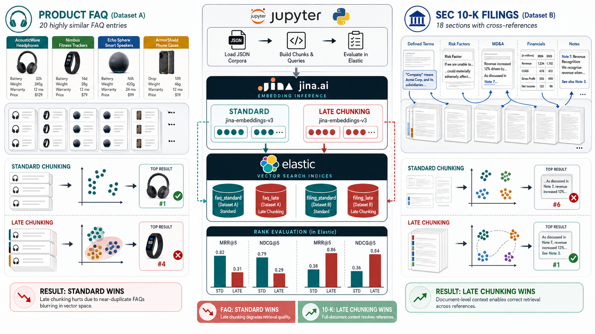
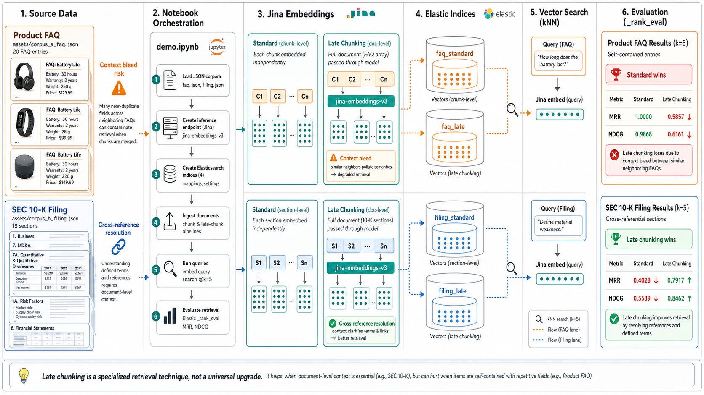
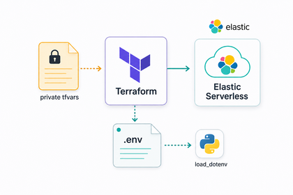
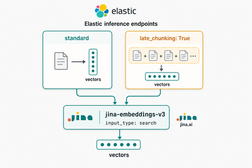
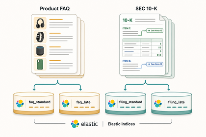
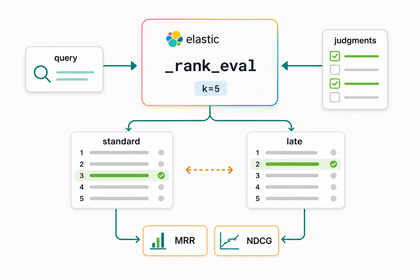

# Late Chunking Is a Tool, Not an Upgrade
*This demo measures late chunking against standard embedding on two corpora — one where it hurts and one where it helps — producing concrete retrieval numbers that engineers can use to make an informed choice.*

This article covers some recent experimentation I did with late chunking.  Late chunking was introduced in this [blog](https://jina.ai/news/late-chunking-in-long-context-embedding-models/) from Jina.ai in 2024.  I put together two test cases here to compare/contrast use cases where this capability increases or decreases search relevance.

---

## What This Article Covers

- Provisioning of an [Elastic Serverless](https://www.elastic.co/cloud/serverless) project via Terraform.
- Creation of two [Elastic inference endpoints](https://www.elastic.co/docs/api/doc/elasticsearch/operation/operation-inference-put) for Jina v3 embeddings - one with standard chunking, the other with late chunking.
- Indexing of two synthetic data sets across four indices.  One standard, one late chunking per data set. 
- Execution of [Elastic ranking evaluation](https://www.elastic.co/docs/reference/elasticsearch/rest-apis/search-rank-eval) of a series of AI-generated queries and judgments to compare standard vs late chunking performance.
---

## Architecture


- All Python and Bash logic is executed from a Jupyter notebook, including the Terraform commands that provision and tear down the Elastic project.
- Elastic Serverless is used as the vector platform for this demo.
- I generated a small synthetic dataset of product FAQs and 10-K filings.  I also generated a judgement list for performing relevance performance testing.

---

## Create Elastic Environment


I use Terraform to spin up an Elastic Serverless instance.  I store my API keys (Elastic and Jina) in a Terraform variables file that I don't commit to GitHub.  I output those variables to a `.env` file that is subsequently loaded via Python (`load_dotenv`)

## Inference Endpoints



I create two Elastic inference endpoints to the Jina.ai hosted embeddings-v3 model.  One endpoint is configured for standard chunking, the other has the `late_chunking` parameter set to `True`.

```python
es.inference.put(
    task_type="text_embedding",
    inference_id="jina-embeddings-v3-late",
    body={
        "service": "jinaai",
        "service_settings": {
            "api_key": os.environ["JINA_API_KEY"],
            "model_id": "jina-embeddings-v3",
            
        },
        "task_settings": {
            "late_chunking": True, 
            "input_type": "search"
        }
    }
)
```

## Data Set



The synthetic dataset here consists of 20 FAQ documents and 18 10-K filing documents across 3 companies.  I load these documents to four Elastic indices as depicted below:

| Index | Corpus | Embedding strategy |
|---|---|---|
| `faq_standard` | Corpus A — Product FAQ | Per-chunk, independent |
| `faq_late` | Corpus A — Product FAQ | Full-document, late chunking |
| `filing_standard` | Corpus B — SEC 10-K Filings | Per-chunk, independent |
| `filing_late` | Corpus B — SEC 10-K Filings | Full-document, late chunking |

All four indices have the same index mapping. The only difference is which inference endpoint was called during ingestion. The sample vectors, printed below, show that standard and late embeddings are distinct for the same document (`FAQ-001`, `wts_intro`).  The late-chunked vectors have been influenced by their neighbors in the document sequence, while the standard vectors reflect only the chunk itself.  Of note, I ensure that the late chunk vectors for the 10-K filings are grouped per the company that is the subject of the filing.  This ensures that the resulting vector isn't polluted with context from another company's data.

```text
  Embedding sample  FAQ-001
  standard  [ 0.0830,  0.0044, -0.0613, -0.0139,  0.2441, ...]
  late      [ 0.0489,  0.0082, -0.0102,  0.0173,  0.2280, ...]
  cosine    0.6207

  Embedding sample  wts_intro
  standard  [ 0.0537,  0.0679,  0.0342, -0.0293,  0.0427, ...]
  late      [ 0.0524,  0.0384, -0.0164, -0.0174,  0.0547, ...]
  cosine    0.8270
```

---

## Retrieval & Measurement



I use an AI-generated judgment list on this data set.  That judgment list consists of documents containing a query and 1-3 ratings per query.  I leverage the Elastic `_rank_eval` API to automate scoring.

**Metrics used:**

- [Mean Reciprocal Rank](https://www.elastic.co/docs/reference/elasticsearch/rest-apis/search-rank-eval#_mean_reciprocal_rank).
- [Normalized Discounted Cumulative Gain](https://www.elastic.co/docs/reference/elasticsearch/rest-apis/search-rank-eval#_discounted_cumulative_gain_dcg) 

**Query strategy:**

I use `semantic_text` for the index vector field and a `semantic` query for the standard indices.  The query string is automatically embedded via the standard inference endpoint.  For the late-chunking indices/queries - I use a `dense_vector` field and explicitly embed the query string and pass it to a `knn` query.


### Results

**Corpus A — Product FAQ**

```
MRR:   Standard 1.0000  →  Late 0.5857   Δ −0.4143
NDCG:  Standard 0.9868  →  Late 0.6161   Δ −0.3707
```

For this test, standard embedding has nearly perfect scores.  This is expected as the FAQ entries are self-contained Q&A pairs with no hidden contextual relationship to their neighbors.  Late chunking actually hurts relevance performance for this scenario.  It pulls in semantically unrelated data that influences each chunk's vector - in a negative way.

**Corpus B — SEC 10-K Filings**

```
MRR:   Standard 0.4028  →  Late 0.7917   Δ +0.3889
NDCG:  Standard 0.5539  →  Late 0.8462   Δ +0.2923
```

The 10-K filing set tells the opposite story - MRR nearly doubles from 0.40 to 0.79.  10-K sections aren't self-contained.  Defined terms like "the Company" or "the Credit Facility" get established early in a filing and referenced throughout, often with no repetition of the full term.  Standard embedding misses that context since each section is embedded in isolation.  Late chunking fixes this - the model sees the full document before producing each section's vector, so those cross-references get resolved.

---

## Conclusion
Late chunking is a legitimate capability - but it's not a free upgrade.  The numbers here are pretty clear on that.  Whether it helps or hurts comes down to the nature of your content.

Takeaways:

- Late chunking can hurt retrieval, not just help it.
- Self-contained documents like product FAQs don't benefit - adjacent chunks have no meaningful relationship, so the extra context is just noise.
- Cross-referential documents like financial filings do benefit - late chunking resolves the defined terms and back-references that isolated embedding misses.
- Know your data before you choose a strategy.

---

## Source

Full source [here.](https://github.com/joeywhelan/late-chunking)

---